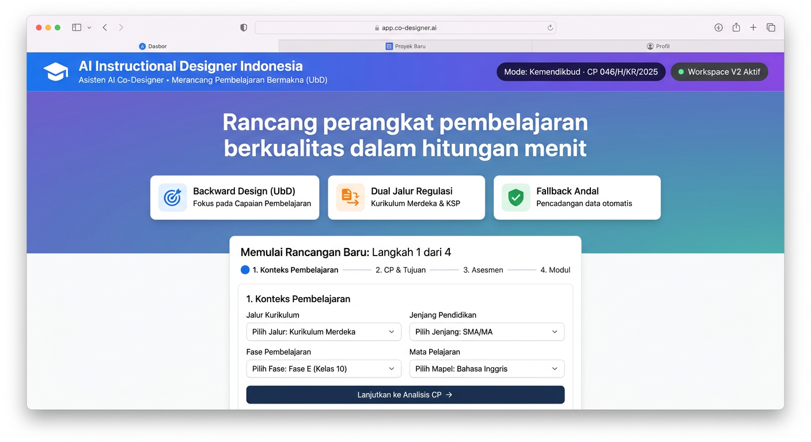

<div align="center">

# 🎓 AI Instructional Designer Indonesia

**Asisten AI untuk guru Indonesia menyusun perangkat pembelajaran berkualitas dengan metode Backward Design (Understanding by Design).**

[Fitur](#-fitur) • [Instalasi](#-instalasi) • [Cara Pakai](#-cara-pakai) • [Deploy](#-deploy) • [Roadmap](#-roadmap) • [Lisensi](#-lisensi)



</div>

---

## ✨ Fitur

- 🧭 **Wizard 4 tahap** — Konteks → Tujuan & Bukti → Paket Pembelajaran → Hasil Akhir
- 🔀 **Dukungan dua jalur regulasi** — Kemendikbud (CP 046/H/KR/2025) & Kemenag (KMA 1503/2025 + KBC 6077/2025)
- 🧠 **Berbasis Google Gemini** dengan *fallback generator* lokal (aplikasi tetap jalan meski API gagal / kuota habis)
- 📝 **Output lengkap** — Modul Ajar, LKPD, Bahan Ajar (siap cetak PDF / paste ke Word / Google Docs)
- 🎯 **Backward Design (UbD)** — bukti belajar dirancang sebelum aktivitas
- 🌈 **Dukungan Panca Cinta, Dimensi Profil Lulusan, dan PPRA**
- 🖨️ **Cetak profesional** — layout A4 rapi, otomatis siap dilampirkan ke administrasi sekolah

## 🛠️ Teknologi

React 19 · TypeScript · Vite 6 · Tailwind CSS v4 · Express 4 · @google/genai 2.4 · html2pdf.js · lucide-react · motion

## 🚀 Instalasi

### Prasyarat

- **Node.js 20+** (cek dengan `node -v`)
- **npm 10+** (biasanya sudah ikut Node.js)
- **API Key Gemini** — gratis dari [aistudio.google.com/apikey](https://aistudio.google.com/apikey)

### Langkah

```bash
git clone https://github.com/pusakamediaid-dotcom/ai-instructional-designer-indonesia.git
cd ai-instructional-designer-indonesia
npm install
cp .env.example .env.local
# edit .env.local — isi GEMINI_API_KEY dengan API key Anda
npm run dev
```

Buka **http://localhost:3000** di peramban Anda.

> 💡 Tidak familiar dengan terminal / GitHub? Ikuti panduan langkah-demi-langkah untuk pengguna awam di [`docs/PANDUAN_UNTUK_KLIEN.md`](docs/PANDUAN_UNTUK_KLIEN.md).

## 🎯 Cara Pakai

1. Buka aplikasi → pilih **jalur regulasi** (Kemendikbud / Kemenag), **jenjang**, **fase**, dan **mata pelajaran**
2. Ikuti **wizard 4 seksi** secara berurutan (tiap seksi bisa diedit sebelum lanjut)
3. Di seksi terakhir, klik **Cetak PDF** atau **Salin ke Word / Google Docs**

Panduan detail dengan tangkapan layar → [`docs/PANDUAN_UNTUK_KLIEN.md`](docs/PANDUAN_UNTUK_KLIEN.md)

## ☁️ Deploy

### Opsi 1 — Vercel (paling mudah, 5 menit)

[](https://vercel.com/new/clone?repository-url=https://github.com/pusakamediaid-dotcom/ai-instructional-designer-indonesia)

1. Klik tombol di atas
2. Login/daftar Vercel dengan akun GitHub
3. Tambahkan environment variable `GEMINI_API_KEY` di dashboard Vercel
4. Selesai — aplikasi Anda live di `https://<nama-projek>.vercel.app`

### Opsi 2 — Google Cloud Run

Panduan lengkap ada di [`docs/PANDUAN_UNTUK_KLIEN.md`](docs/PANDUAN_UNTUK_KLIEN.md#deploy-ke-google-cloud-run).

## 🗺️ Roadmap

Versi saat ini adalah **MVP publik pertama (v0.1.0)**. Rencana pengembangan berdasarkan Blueprint GPP-AI klien terdokumentasi di [`docs/ROADMAP.md`](docs/ROADMAP.md). Highlight rencana:

- Pipeline **6 tahap terpisah** dengan validasi berjenjang (CP → TP → ATP → Asesmen → Kegiatan → Kelengkapan)
- **RAG (Retrieval-Augmented Generation)** anti-halusinasi untuk data CP
- **Knowledge base CP** untuk semua fase (A–F) semua mapel (umum + agama + mulok)
- **Kolaborasi antar guru**, riwayat modul, library pribadi
- **Ekspor Google Docs** langsung (bukan copy-paste)

## 📚 Referensi Resmi

| Regulasi | Judul | Instansi |
|---|---|---|
| **KepBSKAP 046/H/KR/2025** | Capaian Pembelajaran Kurikulum Merdeka | BSKAP Kemdikbudristek |
| **KMA 1503/2025** | Kurikulum Madrasah | Kementerian Agama |
| **SK Dirjen Pendis 6077/2025** | Panduan Kurikulum Berbasis Cinta (KBC) | Ditjen Pendidikan Islam |

Semua PDF regulasi tersedia terpisah (tidak di-commit ke repo untuk menjaga ukuran repo tetap kecil).

## 🤝 Kontribusi

Kontribusi sangat diterima! Baca [`CONTRIBUTING.md`](CONTRIBUTING.md) untuk panduan singkat.

## 📄 Lisensi

MIT © 2026 Pusaka Media ID — lihat [`LICENSE`](LICENSE) untuk teks lengkap.

---

<div align="center">

Dibuat dengan ❤️ untuk guru Indonesia.

</div>
