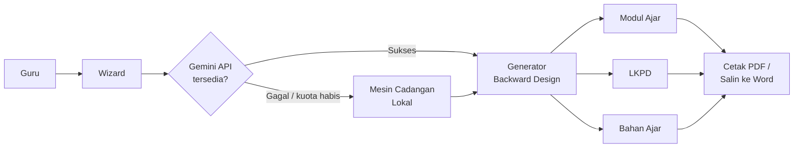

<div align="center">


# AI Instructional Designer Indonesia

Asisten perancang perangkat pembelajaran berkualitas untuk guru Indonesia, berbasis metode Backward Design (Understanding by Design).

[](https://github.com/pusakamediaid-dotcom/ai-instructional-designer-indonesia/actions/workflows/ci.yml)
[](LICENSE)
[](https://nodejs.org)

</div>

---

## Daftar Isi

- [Screenshot](#screenshot)
- [Fitur](#fitur)
- [Arsitektur](#arsitektur)
- [Cara Pakai](#cara-pakai)
- [Instalasi](#instalasi)
- [Deploy](#deploy)
- [Roadmap](#roadmap)
- [Kontribusi](#kontribusi)
- [Referensi Resmi](#referensi-resmi)
- [Ucapan Terima Kasih](#ucapan-terima-kasih)
- [Lisensi dan Sitasi](#lisensi-dan-sitasi)

---

## Screenshot

<div align="center">


*Wizard empat tahap: Konteks, Tujuan dan Bukti, Paket Pembelajaran, dan Hasil Akhir.*

</div>

---

## Fitur

| Fitur | Deskripsi Singkat |
|---|---|
| Wizard Empat Tahap | Konteks, Tujuan dan Bukti, Paket, Hasil Akhir — mengikuti prinsip Understanding by Design |
| Dua Jalur Regulasi | Kemendikbud (CP 046/H/KR/2025) dan Kemenag (KMA 1503 + KBC 6077) dalam satu aplikasi |
| Palet Adaptif | Warna antarmuka menyesuaikan jalur yang dipilih |
| Basis Google Gemini | Model AI terkini untuk generasi konten kontekstual berkualitas |
| Mesin Cadangan | Aplikasi tetap berjalan meski kuota Gemini habis |
| Output Lengkap | Modul Ajar, LKPD, dan Bahan Ajar dalam satu kali proses |
| Cetak Profesional | Layout A4 rapi, siap dilampirkan ke administrasi sekolah |
| Nilai Karakter Terintegrasi | Panca Cinta (Kemenag), Dimensi Profil Lulusan (Kemendikbud), dan PPRA |
| Basis Data Awal | 160 Capaian Pembelajaran Fase A dari 17 mata pelajaran (format JSON) |

---

## Arsitektur



Prinsip inti aplikasi adalah *Backward Design (Understanding by Design)*, yaitu merancang bukti belajar (asesmen) terlebih dahulu, sebelum menyusun kegiatan pembelajaran. Pendekatan ini mencegah pola umum "aktivitas dulu, asesmen belakangan" yang sering menghasilkan modul tidak selaras.

---

## Cara Pakai

Alur pemakaian dalam empat langkah sederhana:

```
Konteks           →  Tujuan dan Bukti   →  Paket             →  Hasil Akhir
─────────            ────────────────       ──────              ──────────
Pilih jalur,         Analisis CP,           Susun asesmen,      Modul Ajar,
jenjang, fase,       susun TP dan KKTP      rancang kegiatan    LKPD, dan
mapel, materi                                                    Bahan Ajar
```

Panduan detail dengan tangkapan layar tersedia di [`docs/PANDUAN_UNTUK_KLIEN.md`](docs/PANDUAN_UNTUK_KLIEN.md).

---

## Instalasi

### Prasyarat

- Node.js 20 atau lebih baru
- npm 10 atau lebih baru
- API Key Gemini (gratis dari [aistudio.google.com/apikey](https://aistudio.google.com/apikey))

<details>
<summary><strong>Windows</strong></summary>

```powershell
# 1. Instal Node.js LTS 20 dari https://nodejs.org
# 2. Instal Git dari https://git-scm.com/download/win
# 3. Buka Git Bash lalu jalankan:

git clone https://github.com/pusakamediaid-dotcom/ai-instructional-designer-indonesia.git
cd ai-instructional-designer-indonesia
npm install
copy .env.example .env.local
# Edit .env.local dengan Notepad, isi GEMINI_API_KEY
npm run dev
```

Buka http://localhost:3000

</details>

<details>
<summary><strong>macOS</strong></summary>

```bash
# Instal Homebrew terlebih dahulu jika belum ada
/bin/bash -c "$(curl -fsSL https://raw.githubusercontent.com/Homebrew/install/HEAD/install.sh)"

brew install node@20 git
git clone https://github.com/pusakamediaid-dotcom/ai-instructional-designer-indonesia.git
cd ai-instructional-designer-indonesia
npm install
cp .env.example .env.local
# Edit .env.local, isi GEMINI_API_KEY
npm run dev
```

Buka http://localhost:3000

</details>

<details>
<summary><strong>Linux (Ubuntu / Debian)</strong></summary>

```bash
curl -fsSL https://deb.nodesource.com/setup_20.x | sudo -E bash -
sudo apt-get install -y nodejs git

git clone https://github.com/pusakamediaid-dotcom/ai-instructional-designer-indonesia.git
cd ai-instructional-designer-indonesia
npm install
cp .env.example .env.local
nano .env.local   # isi GEMINI_API_KEY
npm run dev
```

Buka http://localhost:3000

</details>

Panduan langkah-demi-langkah untuk pengguna yang belum familiar dengan terminal tersedia di [`docs/PANDUAN_UNTUK_KLIEN.md`](docs/PANDUAN_UNTUK_KLIEN.md).

---

## Deploy

Aplikasi ini terdiri dari antarmuka React dan server Node.js/Express. Karena membutuhkan server yang berjalan berkelanjutan, gunakan platform yang mendukung Node.js server (bukan hosting statis).

### Opsi 1 — Google Cloud Run (Direkomendasikan)

Cocok karena mendukung Node.js secara native, dapat diskalakan otomatis, dan tersedia kredit gratis untuk akun baru.

```bash
gcloud auth login
gcloud config set project <PROJECT_ID>
gcloud services enable run.googleapis.com cloudbuild.googleapis.com

gcloud run deploy ai-instructional-designer \
  --source . \
  --region asia-southeast2 \
  --allow-unauthenticated \
  --set-env-vars GEMINI_API_KEY=<API_KEY_ANDA>
```

Setelah 3 hingga 5 menit, URL aplikasi akan tampil di terminal. Detail lengkap tersedia di [`docs/PANDUAN_UNTUK_KLIEN.md — Bagian E`](docs/PANDUAN_UNTUK_KLIEN.md#e-deploy-ke-google-cloud-run).

### Opsi 2 — Railway atau Render

Kedua platform mendeteksi `Dockerfile` di repositori dan menjalankannya secara otomatis.

- Railway: [railway.app/new](https://railway.app/new) → connect repositori → tambahkan env var `GEMINI_API_KEY` → Deploy
- Render: [render.com/deploy](https://render.com/deploy) → New Web Service → Docker → connect repositori → env var → Create

### Opsi 3 — Docker Lokal atau VPS

```bash
docker build -t ai-instructional-designer .
docker run -p 8080:8080 -e GEMINI_API_KEY=<API_KEY_ANDA> ai-instructional-designer
```

Buka http://localhost:8080

### Catatan tentang Vercel

Vercel dirancang untuk static site dan serverless functions. Aplikasi ini memakai Express server berkelanjutan, sehingga Vercel belum didukung pada rilis saat ini. Refactor ke Vercel Functions tercatat di [`docs/ROADMAP.md`](docs/ROADMAP.md).

---

## Roadmap

Tahap pengembangan yang direncanakan:

| Tahap | Fokus |
|---|---|
| Rilis Awal | Wizard empat tahap, dua jalur regulasi, mesin cadangan lokal |
| Tahap Berikutnya | Pipeline enam tahap terpisah dengan structured output |
| Ekspansi Skala Sekolah | Semua mata pelajaran Fase C, RAG basis pengetahuan CP |
| Ekspansi Lintas Jenjang | Semua fase A sampai F |
| Kolaborasi Antar Guru | Basis data, akun, dan pustaka modul bersama |

Rincian lengkap tersedia di [`docs/ROADMAP.md`](docs/ROADMAP.md).

---

## Kontribusi

Kontribusi terbuka untuk siapa pun — guru, pengembang, akademisi, atau pihak yang peduli pendidikan Indonesia. Beberapa cara memulai:

- Menemukan bug, buka [Bug Report](https://github.com/pusakamediaid-dotcom/ai-instructional-designer-indonesia/issues/new?template=bug_report.yml)
- Punya ide fitur, buka [Feature Request](https://github.com/pusakamediaid-dotcom/ai-instructional-designer-indonesia/issues/new?template=feature_request.yml)
- Ada pertanyaan, buka [Pertanyaan](https://github.com/pusakamediaid-dotcom/ai-instructional-designer-indonesia/issues/new?template=question.yml)
- Ingin kontribusi kode, baca [`CONTRIBUTING.md`](CONTRIBUTING.md)

---

## Referensi Resmi

| Regulasi | Judul | Instansi |
|---|---|---|
| KepBSKAP 046/H/KR/2025 | Capaian Pembelajaran Kurikulum Merdeka | BSKAP Kemdikbudristek |
| KMA 1503/2025 | Kurikulum Madrasah | Kementerian Agama |
| SK Dirjen Pendis 6077/2025 | Panduan Kurikulum Berbasis Cinta (KBC) | Ditjen Pendidikan Islam |

Dokumen regulasi tersedia terpisah dari repositori ini untuk menjaga ukuran tetap ringan.

---

## Ucapan Terima Kasih

Aplikasi ini lahir dari kebutuhan nyata guru madrasah ibtidaiyah yang ingin fokus mengajar tanpa terbebani administrasi. Terima kasih kepada:

- Para guru Indonesia yang memberi umpan balik dan menjadi inspirasi utama proyek
- Tim Google AI Studio dan Gemini atas platform serta API untuk edukasi
- Komunitas open source di balik React, Vite, Tailwind CSS, Express, dan seluruh paket yang digunakan
- BSKAP Kemdikbud dan Ditjen Pendis Kemenag atas dokumen regulasi yang terbuka publik

Semoga aplikasi ini benar-benar meringankan beban guru di seluruh nusantara.

---

## Lisensi dan Sitasi

Dirilis di bawah [MIT License](LICENSE). Bebas dipakai, dimodifikasi, dan dikomersialkan.

Untuk sitasi dalam publikasi akademik:

```bibtex
@software{ai_instructional_designer_indonesia,
  title   = {AI Instructional Designer Indonesia: Asisten Perancang
             Perangkat Pembelajaran Berbasis Backward Design},
  year    = {2026},
  url     = {https://github.com/pusakamediaid-dotcom/ai-instructional-designer-indonesia}
}
```

---

<div align="center">

MIT License — Dibuat untuk guru Indonesia.

</div>
