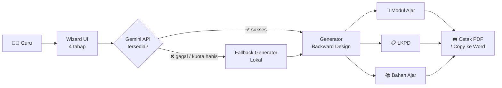

<div align="center">


# 🎓 AI Instructional Designer Indonesia

**Asisten AI untuk guru Indonesia menyusun perangkat pembelajaran berkualitas dengan metode Backward Design (Understanding by Design).**

[](https://github.com/pusakamediaid-dotcom/ai-instructional-designer-indonesia/actions/workflows/ci.yml)
[](LICENSE)
[](https://nodejs.org)
[](#)
[](#)
[](#-deploy)

<!-- Aktifkan setelah FUNDING.yml diisi:
[](https://github.com/sponsors/pusakamediaid-dotcom)
-->

</div>

---

## 📑 Daftar Isi

- [Screenshot](#-screenshot)
- [Fitur](#-fitur)
- [Arsitektur](#-arsitektur)
- [Cara Pakai](#-cara-pakai)
- [Instalasi](#-instalasi)
- [Deploy](#-deploy)
- [Roadmap](#-roadmap)
- [Kontribusi](#-kontribusi)
- [Referensi Resmi](#-referensi-resmi)
- [Ucapan Terima Kasih](#-ucapan-terima-kasih)
- [Lisensi & Sitasi](#-lisensi--sitasi)

---

## 📸 Screenshot

<div align="center">


*Wizard 4 tahap: Konteks → Tujuan &amp; Bukti → Paket Pembelajaran → Hasil Akhir.*

</div>

> 🎥 **Video demo:** menyusul di rilis v0.2 (link YouTube akan ditambahkan di sini).

---

## ✨ Fitur

| | Fitur | Deskripsi Singkat |
|---|---|---|
| 🧭 | **Wizard 4 Tahap** | Konteks → Tujuan &amp; Bukti → Paket → Hasil Akhir, mengalir logis mengikuti UbD |
| 🔀 | **Dual Jalur Regulasi** | Kemendikbud (CP 046/H/KR/2025) &amp; Kemenag (KMA 1503 + KBC 6077) dalam satu app |
| 🎨 | **Palet Dinamis** | Warna UI berganti otomatis: indigo untuk Kemendikbud, teal untuk Kemenag |
| 🧠 | **Berbasis Google Gemini** | Model AI terkini untuk generate konten kontekstual berkualitas |
| 🛡️ | **Fallback Andal** | Aplikasi tetap jalan meski kuota Gemini habis (mesin lokal siaga otomatis) |
| 📝 | **Output Lengkap** | Modul Ajar, LKPD, Bahan Ajar — sekali generate, langsung dapat 3 dokumen |
| 🖨️ | **Cetak Profesional** | Layout A4 rapi, siap dilampirkan ke administrasi sekolah |
| 🌈 | **Karakter Terintegrasi** | Panca Cinta (Kemenag), Dimensi Profil Lulusan (Kemendikbud), PPRA |
| 📊 | **Bonus Data Seed** | 160 Capaian Pembelajaran Fase A dari 17 mata pelajaran (JSON) |

---

## 🏗️ Arsitektur



**Prinsip inti:** *Backward Design (Understanding by Design)* — bukti belajar (asesmen) dirancang **sebelum** kegiatan pembelajaran, bukan sesudahnya. Ini mencegah pola umum "aktivitas dulu, asesmen belakangan" yang sering menghasilkan modul tidak selaras.

---

## 🎯 Cara Pakai

Alur pemakaian dalam 4 langkah:

```
Konteks           →  Tujuan & Bukti     →  Paket             →  Hasil Akhir
─────────            ──────────────         ──────            ──────────
Pilih jalur,         Analisis CP,           Susun asesmen,     Modul Ajar +
jenjang, fase,       susun TP + KKTP        rancang kegiatan   LKPD + Bahan Ajar
mapel, materi                                                   siap cetak
```

Detail langkah dengan tangkapan layar → [`docs/PANDUAN_UNTUK_KLIEN.md`](docs/PANDUAN_UNTUK_KLIEN.md).

---

## 🚀 Instalasi

### Prasyarat

- **Node.js 20+** &nbsp;·&nbsp; **npm 10+** &nbsp;·&nbsp; **API Key Gemini** (gratis di [aistudio.google.com/apikey](https://aistudio.google.com/apikey))

<details>
<summary><strong>🪟 Windows</strong></summary>

```powershell
# 1. Install Node.js LTS 20 dari https://nodejs.org (installer .msi)
# 2. Install Git dari https://git-scm.com/download/win
# 3. Buka Git Bash, jalankan:

git clone https://github.com/pusakamediaid-dotcom/ai-instructional-designer-indonesia.git
cd ai-instructional-designer-indonesia
npm install
copy .env.example .env.local
# Edit .env.local dengan Notepad — isi GEMINI_API_KEY
npm run dev
```

Buka **http://localhost:3000**

</details>

<details>
<summary><strong>🍎 macOS</strong></summary>

```bash
# Install Homebrew dulu jika belum ada
/bin/bash -c "$(curl -fsSL https://raw.githubusercontent.com/Homebrew/install/HEAD/install.sh)"

brew install node@20 git
git clone https://github.com/pusakamediaid-dotcom/ai-instructional-designer-indonesia.git
cd ai-instructional-designer-indonesia
npm install
cp .env.example .env.local
# Edit .env.local — isi GEMINI_API_KEY
npm run dev
```

Buka **http://localhost:3000**

</details>

<details>
<summary><strong>🐧 Linux (Ubuntu / Debian)</strong></summary>

```bash
# Install Node.js 20 via NodeSource
curl -fsSL https://deb.nodesource.com/setup_20.x | sudo -E bash -
sudo apt-get install -y nodejs git

git clone https://github.com/pusakamediaid-dotcom/ai-instructional-designer-indonesia.git
cd ai-instructional-designer-indonesia
npm install
cp .env.example .env.local
nano .env.local   # isi GEMINI_API_KEY
npm run dev
```

Buka **http://localhost:3000**

</details>

> 💡 Belum familiar dengan terminal? Panduan step-by-step untuk pemula → [`docs/PANDUAN_UNTUK_KLIEN.md`](docs/PANDUAN_UNTUK_KLIEN.md).

---

## ☁️ Deploy

Aplikasi ini terdiri dari **frontend (React)** + **backend Node.js/Express**. Karena butuh server long-running, pilih platform yang mendukung Node.js server (**bukan** static hosting).

### 🥇 Opsi 1 — Google Cloud Run (Rekomendasi)

Cocok karena native Node.js, auto-scale ke nol saat idle (murah), dan tersedia $300 kredit gratis untuk akun baru.

```bash
# Prasyarat: gcloud CLI ter-install, akun GCP siap
gcloud auth login
gcloud config set project <PROJECT_ID>
gcloud services enable run.googleapis.com cloudbuild.googleapis.com

# Deploy langsung dari source (Cloud Run auto-build via Dockerfile)
gcloud run deploy ai-instructional-designer \
  --source . \
  --region asia-southeast2 \
  --allow-unauthenticated \
  --set-env-vars GEMINI_API_KEY=<API_KEY_ANDA>
```

Tunggu 3–5 menit → URL aplikasi muncul di terminal. Selesai. Detail lengkap ada di [`docs/PANDUAN_UNTUK_KLIEN.md` — Bagian E](docs/PANDUAN_UNTUK_KLIEN.md#e-deploy-ke-google-cloud-run).

### 🥈 Opsi 2 — Railway atau Render (Satu Klik)

Kedua platform otomatis mendeteksi `Dockerfile` di repo dan menjalankannya.

- **[Railway](https://railway.app/new)** — connect GitHub → pilih repo → tambah env var `GEMINI_API_KEY` → Deploy
- **[Render](https://render.com/deploy)** — New Web Service → Docker → connect repo → env var → Create

### 🥉 Opsi 3 — Docker Lokal / VPS

```bash
docker build -t ai-instructional-designer .
docker run -p 8080:8080 -e GEMINI_API_KEY=<API_KEY_ANDA> ai-instructional-designer
```

Buka **http://localhost:8080**

### ⚠️ Catatan tentang Vercel

Vercel dirancang untuk static site &amp; serverless functions. Aplikasi ini memakai Express server long-running, jadi **Vercel belum didukung di v0.1** (endpoint `/api/design/*` akan 404). Refactor ke Vercel Functions ada di [`docs/ROADMAP.md`](docs/ROADMAP.md).

---

## 🗺️ Roadmap

Versi saat ini adalah **MVP publik pertama (v0.1.0)**. Rencana rilis:

| Versi | Fokus | Target |
|---|---|---|
| **v0.2** | Pipeline 6 tahap terpisah + structured output (JSON mode) | Kualitas output lebih konsisten &amp; anti-halusinasi |
| **v1.0** | Semua mapel Fase C + RAG knowledge base CP | Siap dipakai guru kelas 5 se-sekolah/gugus |
| **v2.0** | Ekspansi semua fase A–F | Siap dipakai lintas jenjang |
| **v3.0** | Kolaborasi antar guru + library modul + analitik | Siap disebarluaskan ke banyak sekolah |

Rincian lengkap → [`docs/ROADMAP.md`](docs/ROADMAP.md) &amp; [Roadmap Tracker Issue](https://github.com/pusakamediaid-dotcom/ai-instructional-designer-indonesia/issues/1).

---

## 🤝 Kontribusi

Kontribusi sangat diterima — baik dari guru, developer, akademisi, atau siapa pun. Beberapa cara untuk mulai:

- 🐛 Temukan bug? Buka [Bug Report](https://github.com/pusakamediaid-dotcom/ai-instructional-designer-indonesia/issues/new?template=bug_report.yml)
- ✨ Punya ide? Buka [Feature Request](https://github.com/pusakamediaid-dotcom/ai-instructional-designer-indonesia/issues/new?template=feature_request.yml)
- ❓ Bingung? Buka [Pertanyaan](https://github.com/pusakamediaid-dotcom/ai-instructional-designer-indonesia/issues/new?template=question.yml)
- 🔨 Mau coding? Baca [`CONTRIBUTING.md`](CONTRIBUTING.md)

Cari [issue "good first issue"](https://github.com/pusakamediaid-dotcom/ai-instructional-designer-indonesia/labels/good%20first%20issue) untuk mulai.

---

## 📚 Referensi Resmi

| Regulasi | Judul | Instansi | Sumber |
|---|---|---|---|
| **KepBSKAP 046/H/KR/2025** | Capaian Pembelajaran Kurikulum Merdeka | BSKAP Kemdikbudristek | [kurikulum.kemdikbud.go.id](https://kurikulum.kemdikbud.go.id) |
| **KMA 1503/2025** | Kurikulum Madrasah | Kementerian Agama | [kemenag.go.id](https://kemenag.go.id) |
| **SK Dirjen Pendis 6077/2025** | Panduan Kurikulum Berbasis Cinta (KBC) | Ditjen Pendidikan Islam | [pendis.kemenag.go.id](https://pendis.kemenag.go.id) |

Semua PDF regulasi tersedia terpisah (tidak di-commit ke repo untuk menjaga ukuran repo tetap kecil).

---

## 🙏 Ucapan Terima Kasih

Aplikasi ini awalnya dibangun di **Google AI Studio** dan lahir dari kebutuhan nyata seorang guru MI kelas 5 yang ingin fokus mengajar tanpa terbebani administrasi. Terima kasih kepada:

- **Guru Indonesia** yang memberi umpan balik &amp; menjadi inspirasi utama proyek
- **Google AI Studio &amp; Gemini team** untuk platform &amp; API gratis untuk edukasi
- **Komunitas open source** — React, Vite, Tailwind CSS, Express, dan semua paket yang dipakai
- **BSKAP Kemdikbud &amp; Ditjen Pendis Kemenag** untuk dokumen regulasi yang terbuka publik

Semoga aplikasi ini benar-benar membantu meringankan beban guru di seluruh nusantara. 🇮🇩

---

## 📄 Lisensi &amp; Sitasi

Dirilis di bawah **[MIT License](LICENSE)** — bebas dipakai, dimodifikasi, dan dikomersialkan.

Jika Anda memakai proyek ini dalam publikasi akademik, mohon sitasi:

```bibtex
@software{ai_instructional_designer_indonesia_2026,
  author  = {Pusaka Media ID},
  title   = {AI Instructional Designer Indonesia: Asisten AI untuk
             Guru dalam Menyusun Perangkat Pembelajaran Berbasis
             Backward Design},
  year    = {2026},
  version = {0.1.0},
  url     = {https://github.com/pusakamediaid-dotcom/ai-instructional-designer-indonesia}
}
```

---

<div align="center">

**MIT © 2026 Pusaka Media ID** &nbsp;·&nbsp; Dibuat dengan ❤️ untuk guru Indonesia.

</div>
